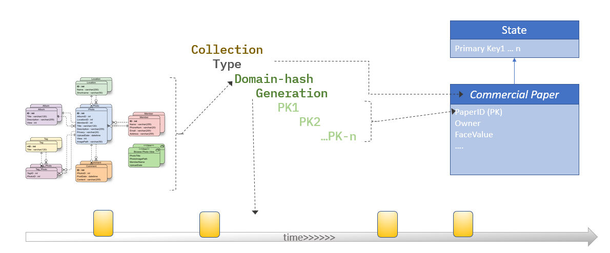

# APIs available to the Contract

Can be broken down into to

 - Ledger API for access to collections (wordstate, private data etc)
 - Transaction API for access to information about the current transaction
 - 'identity' API for information about who requested this tx.
 - Data API for handling the data model

## Ledger API

- Obtain the `LedgerService` from the Context passed to the transaction function.

```
LedgerService service = ctx.getLedgerService()
```

- LedgerService provides access to get a 'StateList'
- Each StateList is a view over a state of a given Type, within a given Collection and (optionally over a given Generation, for a specific Model version)
- StateList provides an API that is similar to the current Stub API as far as states are concerned.

```
// Main CRUD methods for state
public async add(state: T)
public async get(key): Promise<T>
public async update(state: T)
public async delete(key): Promise<void>

// Query methods for states
public async getAllStates(): Promise<T[]>
public async getRange(primarykeys: string[]): Promise<T[]>
public async getRangeWithPaginsation(primarykeys: string[]): Promise<T[]>

// More complex data handling
public async age(key: string, ageTo: string)
```

[See TypeScript Example](./fabric-smart-contracts-ts/src/ledger-api/state-list.ts)

### Data

The composite-key based approach to the ledger, and the 'alphabetic' ordering of the keys, gives an access model that is a hierchy.

For example with a key of 'area:weather-station:measurement', it is possible to do a query for a specific location, and all the measurement within a given weather station. Likewise you could get all the measurements for a range of weather stations. But not possible to get a specific type of measurement for a range of weather stations.

- Unification of World State and Private Collections - the world state is a private collection with name '' (the emptry string)
- By being able to get a binary (protobuf) definition of the metadata, it's possible to create a 'domain-hash' that could be used to determine if the same model is being used on either end of a communcation
- Generator idea is to be able to age, or move to a different area of the 'key space' a set of states. This permits more focused queries to say just the 'live' set of data, 
- Primary Keys, considers as composite if needed - similar to relation models.




State class. States have a type, unique key, and a lifecycle current state
the current state is determined by the specific subclass.

The underlying key is important as it indexes more than for example a single person.
Also the key is important as it at the key level that 'state based endorsement' takes
place.

 ```
 [collection]:[type]:[model]:[generation]:[pk_1]:[pk_2]:...:[pk_n]
 ```


 ### Example

 ```
greetings = new StateList<Greeting>(this, Greeting.prototype, StateList.WORLD_STATE);
greetings.add(new Greeting());

privategreetings = new StateList<Greeting>(this, Greeting.prototype, 'PRIVATE_DATA_ID');
privategreetings.add(new Greeting().setText('Secret Code'));

```

